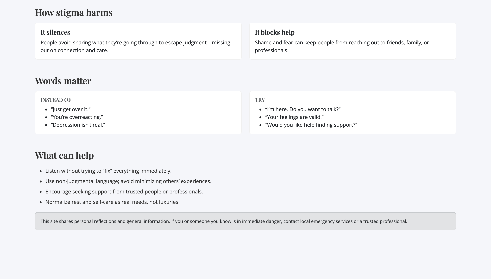

Access:  
- https://tabisevi-code.github.io/Tabina-website/index.html

Overview & Audience
So this website is basically about the stigma around mental health. This was inspired by something i said years ago that I regret — I used to think depression wasn’t real until I went through stuff myself. It’s me reflecting on that and talking about how people (for example younger me) don’t really understand how serious it can be. This site is for anyone who’s ever been told to “just get over it” or who wants to actually understand what others go through :) .

 Site Map
- Home (`index.html`) — contains: theme statement, hero, story summary, CTA
- Understanding (`stigma.html`)— What stigma is, how it harms, better language, what helps
- Reflection (`reflection.html`) —  personal story and lessons learnt :)

Design Notes
- **Framework:** Bootstrap 5 for the consistent andresponsive layout you're looking for.
- **Style:** blue and white theme, serif for the headings, sans-serif for the body.
- **Structure:** Clear sections with levels, clean navigation bar and footer.
- **Accessibility:** Meaningful images, readable contrast, and simple but impactful language!

Screenshots

Credits
- intro photo : https://www.pexels.com/photo/woman-sitting-on-gray-rock-near-body-of-water-185801/
- my story photo : https://www.pexels.com/photo/photo-of-person-kissing-a-dog-on-grass-field-2666154/
- support photo : https://www.pexels.com/photo/you-are-not-alone-quote-board-on-brown-wooden-frame-2821220/
- Bootstrap 5 (cdn was used)

Bonus
- Responsive behavior is built in via Bootstrap grid; you can add smooth scrolling or small animations !!
